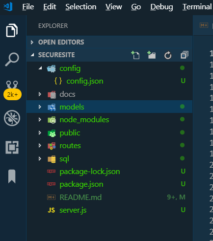
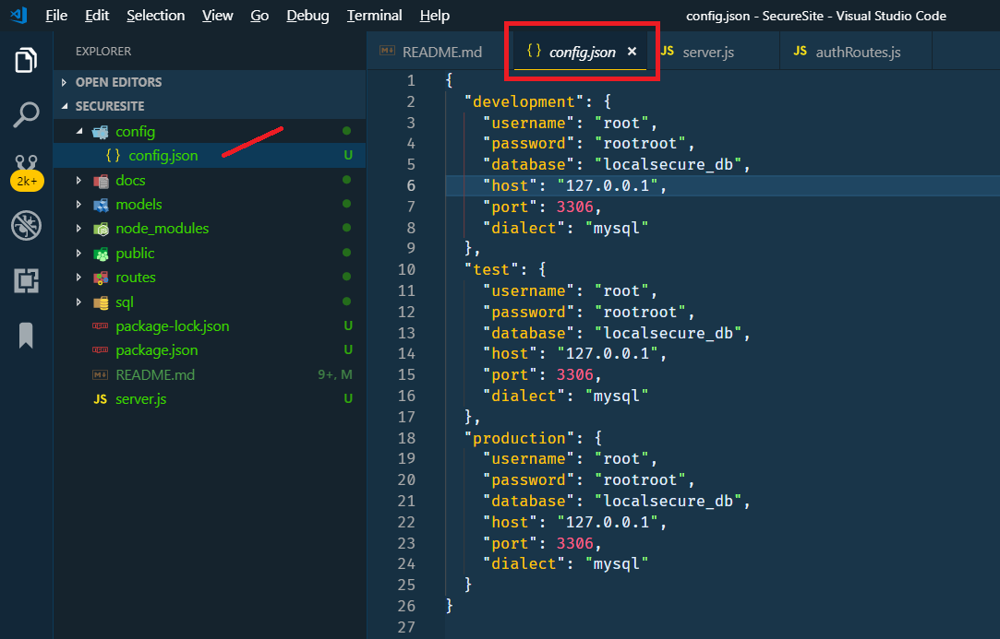
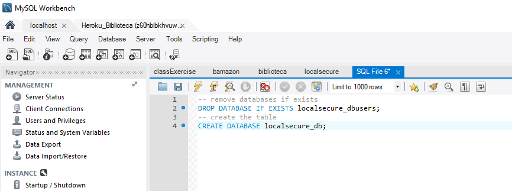
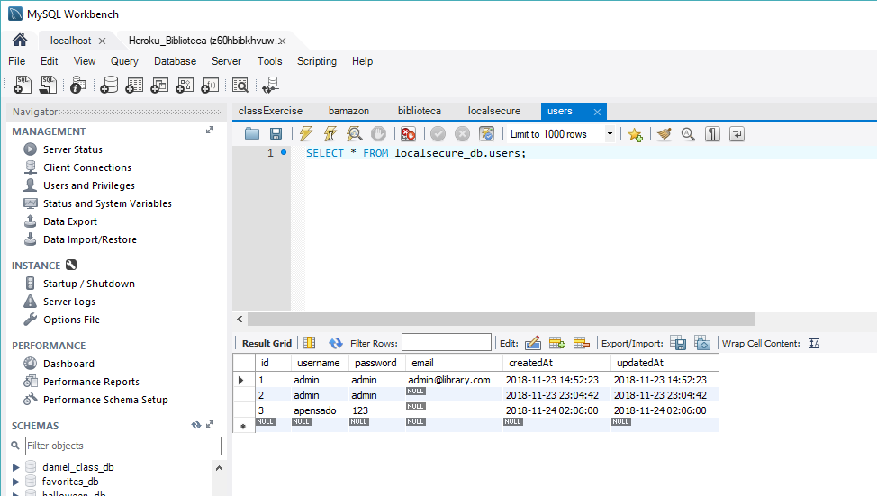
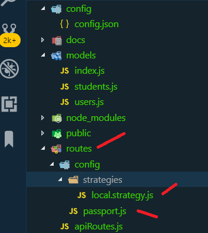

# Secure Site: Using Passport for Authentication and Authorization 

_By Armando Pensado_

##Description

I wrote this project as an example how to add authorization and authentication using Node JS, Express, sequelize (ORM), Passport npm, and MySQL. Passport is very popular library in the JavaScript world for adding login functionality (http://www.passportjs.org/). 

I was struggling following the documentation offered at Passport website, but I found an excellent Pluralsight video by Jonathan Mills that help me understand the steps involved. The video implements the solution using express.router(), however, this article implement routes using a different technique. 

After the steps to implement Passport are understood, then the documentation in the website starts making sense.

In summary, the project offer functionality to sing-Up, sign-in, and sign-out. In other words, the user can enroll into the application, login, and logout. Also, the system will restrict access to a page, unless the user has logged in.


## Assumptions 

It is assumed that the reader has basic experience implementing a Node JS application using Express and she/he is familiar with Visual Studio code editor. 

It is also assumed that the reader knows how to work with MySQL and she/he has MySQL installed in the local computer and MySQL Workbench is available.

It is assumed that the reader is familiar with “sequelize” and its models, as an ORM to connect and handle the database.

## Project considerations

The project within this GitHub pages is very simple in nature, to explain how Passport can be implemented, it contains a basic folder structure with three HTML pages. The project structure is a s follows:



The connection to MySQL database is established within the config/config.json file and this looks as follows:



The **model/index.js** is a traditional template that uses the **config.json.js** to create the Sequelize object with its connection, and reads all files contained within the **models** folder to associate the models with the database using the ORM functionality.

There are only two model, one for the **users** table and a second for **students** tables. The **users** table will hold the user login access. For demonstration purposes the passwords are kept as text. A real-life application will require the password to be stored encrypted. 

The project separates HTML and API routes.  The API routes have no implementation, as the main focus will be to block access to a HTML routes when the user is not authenticated in the application.

## NPM dependencies

The project will need to initialize the NPM and add necessary dependencies for express, sequelize and mysql. Here are the commends.

```js
npm init -y
npm i express sequelize mysql2
npm i body-parser
```

If the reader works with the project offered here, it is only needed to initialize the NPM already associated. The command is as follows:

```js
npm i
```

## Project database

To get started with the project, a database must be created. The “sql/localsecure.sql” file offers the way to create the database using MySQL workbench and offer the way to add one initial user. 

The tables are not created manually, sequelize will generate them the first time the Node JS server is started.

To create the database the following command need to be executed.

```sql
-- remove databases if exists
DROP DATABASE IF EXISTS localsecure_db;
-- create the table
CREATE DATABASE localsecure_db;

```



To add one user the following command can be executed.

```sql
-- add data
USE localsecure_db;
INSERT INTO users (username,password,email,createdAt,updatedAt)
VALUE("admin","admin","admin@library.com",now(),now());
```

After the insert command, the table can queried to confirm that the record was inserted.




## Implementing Passport

**Step 1** - The first step is to install the necessary NPM dependencies: express-session, cookie-parser, passport, and passport-local. The commands are as follows.

```js
npm i express-session
npm i cookie-parser
npm i passport passport-local
```

**Step 2** - The second step is to add a passport.js filed under a config file. To avoid confusion, the file was added under routes/config. Additionally, inside the routes/config, a “strategies” folder is needed, with a local.strategy.js file




The _passport.js_ file will look as depicted below. The file will initialize Passport, and establish the methods to serialize and deserialize the user in the session. Serialize method will store the user into the session and the deserialize will retrieve the user from the session.

The **done** parameter is a callback function.

``` js
// passport dependencies
const passport = require('passport');
require('./strategies/local.strategy')();

module.exports = (app) => {
  // Initialize 
  app.use(passport.initialize());
  app.use(passport.session());

  // Stores user in session
  passport.serializeUser((user, done) => {
    // call back that actually store the user in session
    // is possible just to store the user.id
    done(null, user);
  });

  // Retrieves user from session
  // if user.id was usedd in serializeUser,
  // this function will recive user.id
  passport.deserializeUser((user, done) => {
    // if usee.id is passed, search ind BD for user
    done(null, user);
  });

} // module.exports
```

The _local.strategy.j_s_ file will use sequelize ORM to access the database. The local-strategy is in charge receiving the user and password, and look into the database if the user exist and the password matches.

The “done” is a callback function that will return the user, if found, authenticating the user.

```js
// passport local startegy
const passport = require('passport')
const { Strategy } = require('passport-local')
//const Strategy = require 'passport-local').Strategy
const db = require('../../../models')

module.exports = () => {

  passport.use( new Strategy( 
    {
      usernameField: 'username',
      passwordField: 'password'
    }, (username, password, done) => {

      // Find-one
      db.users.findOne({
          where: {
            username: username
          }
        })
        .then(user => {
          // Does password matches?
          if (user !== null && user.password === password) {
            done(null, user);
          } else {
            done(null, false);
          }
        })
        .catch(e => console.error(e))
    }

  ))

} // module.exports
```

**Step 3** – Inside the server.js, the passport library needs to be defined along the cookie-parse and express-session. 

The express server will use the cookie parser and the session. The session need a secret key, that can be in general any string.

The code added looks as follows.

```js
// passport, cookie-parser, express-session
const passport = require('passport');
const cookieParser = require('cookie-parser');
const session = require('express-session');
// STEP 2:  passport
app.use(cookieParser());
app.use(session({ secret: 'library' }));
// STEP 3:  passport
require('./routes/config/passport.js')(app);

```

**Step 4** – The next step is to establish the authentication routes. These were defined independently inside the **routes/authRoutes**. There are routes for Sign-Up, Sign-In, and Sign-out.

The _Sign-Up_ route is for a new user to enroll into application. This will first check if the user does not exist already, and if it does not, will create the new entry into the database “users” table. Upon a successful creation, the user will remain logged in in the session.

The _Sign-In_ uses the Passport Authenticate against the local strategy. The code can be set to respond to different events. The key ones is when the user fails to provide invalid user name and password, or when succeeded. The programmer can decide where to redirect the flow of the application base on the event.

```js
app.post('/signIn', (req, res, next) => {
    // authenticate
    passport.authenticate('local', (err, user, info) => {
      if (err) {
        return next(err)
      }
      if (!user) {
        // redirect with a code, will set redirect flag in response to false
        return res.redirect(200, '/signIn')
      }
      req.login(user, (err) => {
        if (err) {
          console.log('error: ', err)
          return next(err)
        }

        console.log('success')
        // redirect without a code, will set redirect flag in response to true
        return res.redirect('/')
      })
    })(req, res, next)

  })
```

_Sing-Out_ is straight forward and removes the user from the session.

The front end will implement a simple logging FORM, and set the AJAX communication with the route, passing along the username and password. This can be observed inside the loginpage.html file.


**Step 5** – The final step is to enforce authorization, using the user that must exist in the session. For this, in the HTML routes, it is defined what routes are permitted if the user in the session exist. The session user will not exist if was not signed in properly.

In this example, the main page and the loginpage.html will be open for anyone. However, accessing the studentpage.html, the user most be in the session. If not, will be redirected to the loginpage.html.

```js
// html Index
const path = require('path')

module.exports = (app) => {
  
  app.get('/signIn', (req, res) => {
    res.sendFile(path.join(__dirname, '../public/loginpage.html'))
  })

  app.get('/students', (req, res) => {
    // authorization
    if(req.user) {
      res.sendFile(path.join(__dirname, '../public/studentpage.html'))
    } else {
      res.redirect('/signIn')
    }    
  })
}
```

## Redirect considerations

As the project is implemented with this current technique, it is important to mention that any routes defined in the authRoutes.js, redirection will not behave as expected, and it is a combined effort of the backend and the frontend to make the redirect happen. 

The back end sends the redirection URL, but will not trigger the change. It is for the frontend to execute the redirection depending on the situation. From example, the sign-up will have redirect commands, one for failure and one for success as depicted below. 

By adding a code to the redirect command, we control that the redirect flag is set to false, in the response message.

```js
// redirect without a code, will set redirect flag in response to true
return res.redirect('/');

// redirect with a code, will set redirect flag in response to false
return res.redirect(200, '/signIn')
```
The redirect flag tells the frontend to execute the redirection to the provided URL in the response message or stay in the current page and show a error message. The sample bellow depicts the idea.

```js
// adding a user into the system
    const signUp = () => {
      event.preventDefault()
      let username = document.querySelector("#username").value
      let password = document.querySelector("#password").value

      // Sign up
      fetch('/signUp', {
          method: 'POST',
          headers: {
            'Content-Type': 'application/json ; charset=utf-8'
          },
          body: JSON.stringify({
            username: username,
            password: password
          })
        })
        .then(r => {
          console.log(r)
          console.log(r.url)
          if (r.redirected)  {
            window.location = r.url
          } else {
            document.querySelector("#invalidLogin")
                    .innerHTML = "User already exist"
          }
        })
        .catch(e => console.error(e))
    }
```

## Authorization considerations

This example presents a very simple table and authorization is enforced base on the existence of the session user. However, this idea can be enhanced if the database has tables for user-roles. This can add additional controls over what user roles have access to different pages. 

## Who maintains and contributes to the project

This is a personal project based on UCI Bootcamp training. 

## Where users can get help with the project

The developer can refer to the following links:


* NodeJs  : https://nodejs.org/en/
* Express : https://www.npmjs.com/package/express
* sequelize: http://docs.sequelizejs.com/
* Passport library documentation: http://www.passportjs.org/
* PluralSight video : https://app.pluralsight.com/library/courses/nodejs-express-web-applications-update/table-of-contents

